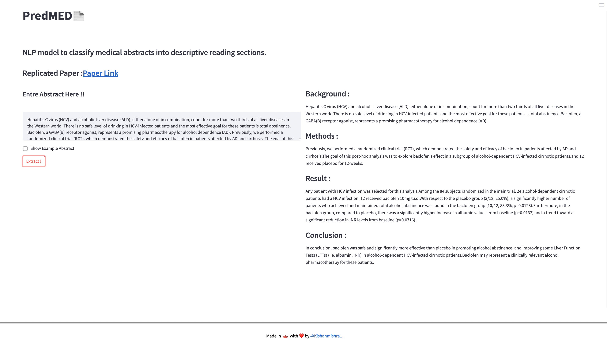
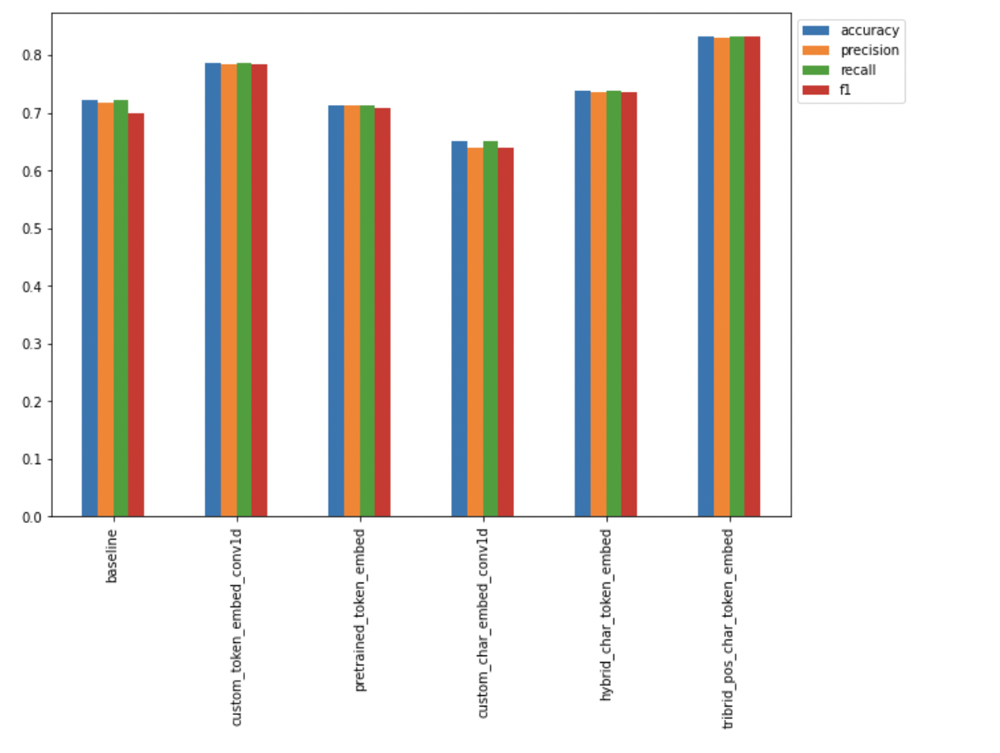

# PREDMED
An NLP model to classify abstract sentences into the role they play (e.g. objective, methods, results, etc) to enable researchers to skim through the literature and dive deeper when necessary.

## Dataset Used
[PubMed 200k RCT dataset](https://github.com/Franck-Dernoncourt/pubmed-rct)

* The PubMed 200k RCT dataset is described in *Franck Dernoncourt, Ji Young Lee. [PubMed 200k RCT: a Dataset for Sequential Sentence Classification in Medical Abstracts](https://arxiv.org/abs/1710.06071). International Joint Conference on Natural Language Processing (IJCNLP). 2017.*

Some miscellaneous information:
- PubMed 20k is a subset of PubMed 200k. I.e., any abstract present in PubMed 20k is also present in PubMed 200k. 
- `PubMed_200k_RCT` is the same as `PubMed_200k_RCT_numbers_replaced_with_at_sign`, except that in the latter all numbers had been replaced by `@`. (same for `PubMed_20k_RCT` vs. `PubMed_20k_RCT_numbers_replaced_with_at_sign`).

## Models Tried
All the note books are availabel [here]("https://github.com/vishalrk1/SkimLit/tree/main/Notebooks")

- NaiveBayes Baseline Model -> 72% Accuracy
- Conv1D Model with token embedding -> 78% Accuracy
- Model using pretrained token embedding ( Universal sentence embedding ) -> 75% Accuracy
- Conv1D Model using character level embedding -> 73% Accuracy 
- Model with both token and charcter level embedding -> 76% Accuracy
- Model with token, character and position level embedding ( https://arxiv.org/pdf/1612.05251.pdf ) -> 81% Accuracy
<!--          -->

## Final Results
### **Model Comparison**

## Packages Used
- Tensorflow
- tensorflow_text
- tensorflow_hub
- sklearn
- Matplotlib
- numpy
- pandas
- spaCy
